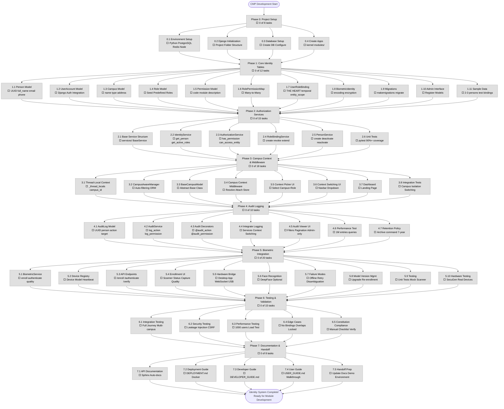

# Campus Management Platform - Implementation Flowchart

**Status Tracking:** This flowchart shows all phases and task groups. AI agents must update task colors as they complete work.

**Color Legend:**
- ⬜ **Gray** = Not Started
- 🟨 **Yellow** = In Progress  
- 🟩 **Green** = Completed
- 🟥 **Red** = Blocked

**Last Updated:** 2025-02-12

---

## Visual Flowchart (Mermaid Diagram)



---

## How to Update This Flowchart

### For AI Agents:

When you complete a task:

1. Find the task in the diagram (e.g., `T1_1`)
2. Change the class from `notStarted` to `completed`
3. Update the task status symbol from ⬜ to 🟩
4. Update the parent phase progress counter

**Example:**

Before:
```
T1_1[1.1 Person Model<br/>⬜ UUID full_name email phone]
class T1_1 notStarted
```

After completion:
```
T1_1[1.1 Person Model<br/>🟩 UUID full_name email phone]
class T1_1 completed
```

And update phase:
```
Phase1[Phase 1: Core Identity Tables<br/>⬜ 1 of 12 tasks]
```

### Status Symbols:

- ⬜ = Not Started (`notStarted` class)
- 🟨 = In Progress (`inProgress` class)
- 🟩 = Completed (`completed` class)
- 🟥 = Blocked (`blocked` class)

---

## Critical Path

The following phases **MUST** be completed in order (dependencies):

```
Phase 0 → Phase 1 → Phase 2 → Phase 3 → Phase 4 → Phase 5 → Phase 6 → Phase 7
  ↓         ↓         ↓         ↓         ↓         ↓         ↓         ↓
Setup    Models   Services  Middleware Logging  Hardware   Testing   Docs
```

**No phase can start until previous phase is complete.**

**Exception:** Phase 5 (Biometric) can be done in parallel with Phase 4 (Audit) if resources allow.

---

## Milestones

- **Milestone 1 (Week 1):** Phase 0 + Phase 1 complete → Core tables exist
- **Milestone 2 (Week 2):** Phase 2 + Phase 3 complete → Authorization works, campus isolation enforced
- **Milestone 3 (Week 3):** Phase 4 complete → All actions audited
- **Milestone 4 (Week 5):** Phase 5 complete → Biometric enrollment/auth functional
- **Milestone 5 (Week 6):** Phase 6 complete → System tested, validated
- **Milestone 6 (Week 7):** Phase 7 complete → Documented, ready for handoff

---

## Progress Tracking

**Overall Completion:** 0% (0 of 106 task groups)

**Phase Breakdown:**
- Phase 0: 0/8 tasks (0%)
- Phase 1: 0/12 tasks (0%)
- Phase 2: 0/15 tasks (0%)
- Phase 3: 0/18 tasks (0%)
- Phase 4: 0/10 tasks (0%)
- Phase 5: 0/20 tasks (0%)
- Phase 6: 0/15 tasks (0%)
- Phase 7: 0/8 tasks (0%)

**Estimated Time Remaining:** 7 weeks (with AI agent assistance)

---

## Rendering This Diagram

### Online (Recommended):
1. Copy the mermaid code block above
2. Paste into: https://mermaid.live/
3. View interactive diagram
4. Export as PNG/SVG

### VS Code:
1. Install "Markdown Preview Mermaid Support" extension
2. Open this file
3. Press Ctrl+Shift+V (preview)

### Command Line:
```bash
# If mermaid-cli was successfully installed
mmdc -i 02_SYSTEM_FLOWCHART.md -o flowchart.png
```

---

## Notes for AI Agents

**CRITICAL:** This flowchart must be kept in sync with `01_MASTER_TASK_LIST.md`

When you update one, update the other!

**Workflow:**
1. Complete task in Master Task List
2. Update task status in this flowchart
3. Commit both files together

**Do not proceed to next phase until current phase is 100% complete.**
