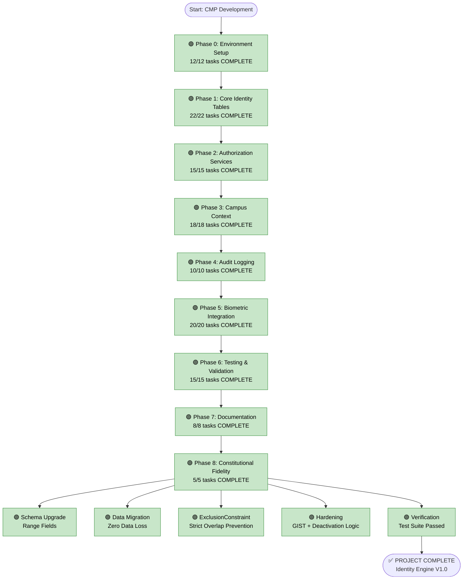

# Campus Management Platform - Progress Flowchart

**Last Updated:** 2026-02-17 13:20
**Status:** PROJECT COMPLETE ✅
**Progress:** 125/125 tasks (100%)

---

## Legend
- 🟢 Complete
- 🟡 In Progress
- 🔴 Not Started
- ⚫ Blocked

---

## 📝 Implementation Highlights

### Phase 8: Constitutional Fidelity
- **Goal:** Enforce strict temporal exclusivity.
- **Solution:** Upgraded `UserRoleBinding` to use PostgreSQL `ExclusionConstraint` with `DateTimeRangeField`.
- **Hardening:** Added GIST index, default validity, and strict deactivation logic.
- **Result:** Mathematical guarantee against overlapping role assignments.

---

## Implementation Flow

---

## Current Progress

**Phase 0:** ✅ 100% (12/12 tasks) **COMPLETE**
**Phase 1:** ✅ 100% (22/22 tasks) **COMPLETE**
**Phase 2:** ✅ 100% (15/15 tasks) **COMPLETE**
**Phase 3:** ✅ 100% (18/18 tasks) **COMPLETE**
**Phase 4:** ✅ 100% (10/10 tasks) **COMPLETE**
**Phase 5:** ✅ 100% (20/20 tasks) **COMPLETE**
**Phase 6:** ✅ 100% (15/15 tasks) **COMPLETE**
**Phase 7:** ✅ 100% (8/8 tasks) **COMPLETE**
**Phase 8:** ✅ 100% (5/5 tasks) **COMPLETE**

**Overall:** 100% (125/125 tasks)

---

## Final Status

**Current Task:** Project Handoff
**Current Phase:** Post-Project Support
**Server Status:** Running on http://127.0.0.1:8001/
**Admin Access:** admin / admin123
