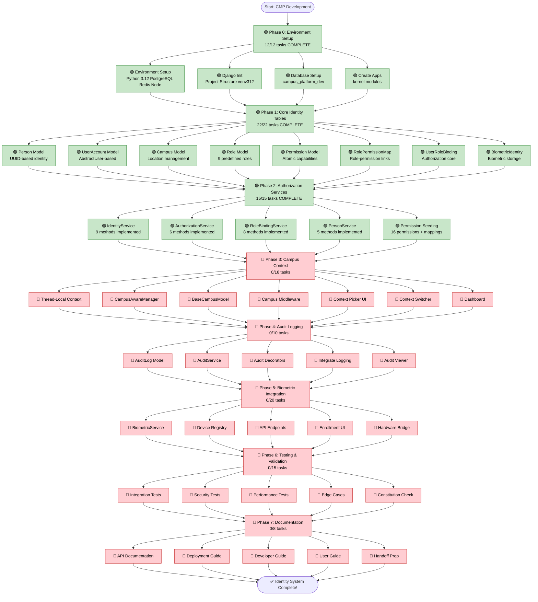

# Campus Management Platform - Progress Flowchart

**Last Updated:** 2026-02-12 19:40  
**Status:** Phase 2 Complete ✅  
**Progress:** 49/120 tasks (41%)  

---

## Legend
- 🟢 Complete
- 🟡 In Progress
- 🔴 Not Started
- ⚫ Blocked

---

## 📝 Implementation Notes

### Python Version Compatibility
- **Issue:** Initially used Python 3.14.0 which is incompatible with Django 5.0
- **Error:** Django admin threw `AttributeError: 'super' object has no attribute 'dicts'`
- **Solution:** Downgraded to Python 3.12.10, recreated environment
- **Result:** All functionality working perfectly

### Current Environment
- Python: 3.12.10
- Django: 5.0
- PostgreSQL: 18.0
- Virtual Environment: `venv312`
- Server: Running on port 8001

---

## Implementation Flow

---

## Current Progress

**Phase 0:** ✅ 100% (12/12 tasks) **COMPLETE**  
**Phase 1:** ✅ 100% (22/22 tasks) **COMPLETE**  
**Phase 2:** ✅ 100% (15/15 tasks) **COMPLETE**  
**Phase 3:** 0% (0/18 tasks)  
**Phase 4:** 0% (0/10 tasks)  
**Phase 5:** 0% (0/20 tasks)  
**Phase 6:** 0% (0/15 tasks)  
**Phase 7:** 0% (0/8 tasks)  

**Overall:** 41% (49/120 tasks)

---

## How to Read This Flowchart

1. **Phases flow left to right** - Each phase must complete before the next
2. **Tasks within phases** - Can be worked on in parallel where dependencies allow
3. **Color coding** - Shows current status at a glance
   - 🟢 Green = Complete
   - 🟡 Yellow = In Progress
   - 🔴 Red = Not Started
4. **Update after each task** - Change status as work progresses

---

## Next Action

**Current Task:** Ready to start Phase 3  
**Current Phase:** Phase 3 - Campus Context & Middleware  
**Blocking:** None - All dependencies complete  
**Server Status:** Running on http://127.0.0.1:8001/  
**Admin Access:** admin / admin123

