# Campus Management Platform - Progress Flowchart

**Last Updated:** 2026-02-22  
**Status:** PROJECT COMPLETE ✅  
**Progress:** 172/172 tasks (100%)

---

## Legend
- 🟢 Complete
- 🟡 In Progress
- 🔴 Not Started
- ⚫ Blocked

---

## 📝 Implementation Highlights

### Phase 16 & 17: Dashboard & Seed Data
- **Goal:** Provide a living UI and realistic test data.
- **Solution:** Implemented modular HTML Dashboard and idempotent Seed command.
- **Result:** Fully functional system with verified metrics (10 students, 3 groups).

---

## Implementation Flow

```mermaid
graph TD
    Start([Start: CMP Development]) --> Phase0

    %% Phase 0
    Phase0[🟢 Phase 0: Environment Setup<br/>12/12 tasks COMPLETE]
    
    Phase0 --> Phase1

    %% Phase 1
    Phase1[🟢 Phase 1: Core Identity Tables<br/>22/22 tasks COMPLETE]
    
    Phase1 --> Phase2

    %% Phase 2
    Phase2[🟢 Phase 2: Authorization Services<br/>15/15 tasks COMPLETE]
    
    Phase2 --> Phase3

    %% Phase 3
    Phase3[🟢 Phase 3: Campus Context<br/>18/18 tasks COMPLETE]
    
    Phase3 --> Phase4

    %% Phase 4
    Phase4[🟢 Phase 4: Audit Logging<br/>10/10 tasks COMPLETE]
    
    Phase4 --> Phase5

    %% Phase 5
    Phase5[🟢 Phase 5: Biometric Integration<br/>20/20 tasks COMPLETE]
    
    Phase5 --> Phase6

    %% Phase 6
    Phase6[🟢 Phase 6: Testing & Validation<br/>15/15 tasks COMPLETE]
    
    Phase6 --> Phase7

    %% Phase 7
    Phase7[🟢 Phase 7: Documentation<br/>8/8 tasks COMPLETE]

    Phase7 --> Phase8

    %% Phase 8
    Phase8[🟢 Phase 8: Constitutional Fidelity<br/>5/5 tasks COMPLETE]
    
    Phase8 --> Phase9

    %% Phase 9
    Phase9[🟢 Phase 9: Academic Core<br/>11 models + 3 services COMPLETE]

    Phase9 --> Phase10

    %% Phase 10
    Phase10[🟢 Phase 10: Admissions Module<br/>Data Pipeline COMPLETE]

    Phase10 --> Phase11

    %% Phase 11
    Phase11[🟢 Phase 11: Attendance Ledger<br/>Immutable Fact Log COMPLETE]

    Phase11 --> Phase12

    %% Phase 12
    Phase12[🟢 Phase 12: Workforce Attendance<br/>Device Integration COMPLETE]

    Phase12 --> Phase13

    %% Phase 13
    Phase13[🟢 Phase 13: Dashboard API<br/>Stateless Metrics COMPLETE]

    Phase13 --> Phase14

    %% Phase 14
    Phase14[🟢 Phase 14: JWT Auth<br/>API Security COMPLETE]

    Phase14 --> Phase15

    %% Phase 15
    Phase15[🟢 Phase 15: Integration Test Suite<br/>36/36 Flows PASSED]

    Phase15 --> Phase16

    %% Phase 16
    Phase16[🟢 Phase 16: Dashboard UI<br/>Modular Shell LIVE]

    Phase16 --> Phase17

    %% Phase 17
    Phase17[🟢 Phase 17: Academic Seed Data<br/>10 Students + 3 Groups VERIFIED]
    
    Phase17 --> Complete

    Complete([✅ PROJECT COMPLETE<br/>Production Ready V1.0])

    %% Styling
    classDef complete fill:#c8e6c9,stroke:#388e3c,color:#000
    
    class Phase0,Phase1,Phase2,Phase3,Phase4,Phase5,Phase6,Phase7,Phase8,Phase9,Phase10,Phase11,Phase12,Phase13,Phase14,Phase15,Phase16,Phase17 complete
```

---

## Current Progress

**Phase 0-8:** ✅ 100% (Identity & Auth)  
**Phase 9-12:** ✅ 100% (Academic & Attendance)  
**Phase 13-15:** ✅ 100% (API & Integration)  
**Phase 16-17:** ✅ 100% (Dashboard & Data)

**Overall:** 100% (172/172 tasks)

---

## Final Status

**Current Task:** Project Handoff  
**Current Phase:** Post-Project Support  
**Server Status:** Running on http://127.0.0.1:8001/  
**Admin Access:** admin / admin123  
**Dashboard:** /dashboard/
