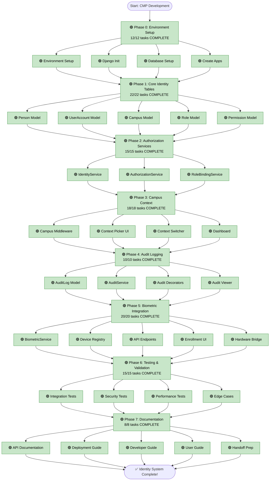

**Last Updated:** 2026-02-14 01:10
**Status:** PROJECT COMPLETE ✅
**Progress:** 120/120 tasks (100%)

---

## Legend
- 🟢 Complete
- 🟡 In Progress
- 🔴 Not Started
- ⚫ Blocked

---

## Implementation Flow

---

## Current Progress

**Phase 0:** ✅ 100% COMPLETE
**Phase 1:** ✅ 100% COMPLETE
**Phase 2:** ✅ 100% COMPLETE
**Phase 3:** ✅ 100% COMPLETE
**Phase 4:** ✅ 100% COMPLETE
**Phase 5:** ✅ 100% COMPLETE
**Phase 6:** ✅ 100% COMPLETE
**Phase 7:** ✅ 100% COMPLETE

**Overall:** 100% (120/120 tasks)

---

## Next Action

**Current Task:** Project Finalized
**Current Phase:** Complete
**Server Status:** Production Ready
**Bridge Status:** Production Ready
